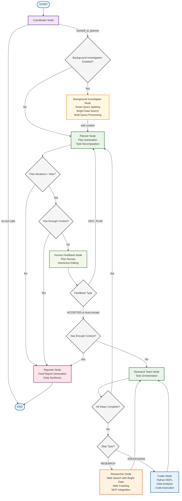

# 🌟 BrightFlow

[](https://www.python.org/downloads/)
[](https://opensource.org/licenses/MIT)
[](https://github.com/bytedance/deer-flow)

> 演示项目：基于 DeerFlow 构建的原型，用于展示 Bright Data 在研究自动化中的网页智能能力。

## 🧪 项目状态

BrightFlow 是一个演示项目与原型，用于展示 Bright Data 的网页智能平台与 AI 驱动研究流程的集成。这是一个用于评估与测试目的的概念验证（PoC）。

重要说明：
- 这是一个演示/原型，并非可直接用于生产的系统
- 作为 Bright Data 能力与 AI 研究工具集成的展示
- 基于 ByteDance 的开源框架 DeerFlow

## 🙏 致谢来源

BrightFlow 是 ByteDance 的 [DeerFlow](https://github.com/bytedance/deer-flow) 的派生版本。我们感谢 DeerFlow 团队与 ByteDance 创建的深度研究框架为本项目奠定基础。

> DeerFlow 原始描述：Deep Exploration and Efficient Research Flow——一个由社区驱动的深度研究框架，构建于开源社区的卓越工作之上。

## Demo

https://github.com/user-attachments/assets/5829964f-31a0-419c-9978-10e15223ccba

## 🚀 BrightFlow 的不同之处

在 DeerFlow 基础上，本演示项目通过 Bright Data 的网页智能平台带来增强能力：

### 🔍 增强的搜索能力
- Bright Data 搜索集成：利用 Bright Data 高级搜索 API 获取更全面、准确的结果
- 企业级数据质量：通过 Bright Data 网络访问更干净、更可靠的数据源
- 全球覆盖：跨地区与多语言的增强搜索能力

### 🕷️ 高级网页抓取
- Bright Data 爬取：集成 Bright Data 强大的爬取基础设施
- 反爬保护：通过 Bright Data 代理网络访问受保护内容
- 可扩展的数据采集：以企业级爬取能力支持大规模研究项目

### 🧠 智能查询处理
- 智能查询拆分：自动将复杂用户问题拆解为多条优化子查询
- 并行研究：同时执行多条研究流，覆盖更全面
- 上下文聚合：汇总多查询结果，形成更丰富的洞察

### 🎨 优化的用户体验
- BrightFlow 品牌设计：全新的品牌化视觉与交互体验
- 更佳性能：基于 Bright Data 基础设施的优化工作流

## 📑 目录

- [🚀 快速开始](#快速开始)
- [🌟 功能](#功能)
- [🔧 Bright Data 配置](#bright-data-配置)
- [🏗️ 架构](#架构)
- [🛠️ 开发](#开发)
- [🐳 Docker](#docker)
- [🗣️ 文本转语音集成](#文本转语音集成)
- [❓ 常见问题](#常见问题)
- [📜 许可证](#许可证)
- [💖 致谢](#致谢)

## 快速开始

BrightFlow 使用 Python 开发，并附带基于 Node.js 的 Web UI。为顺利完成安装，建议使用以下工具：

### 推荐工具

- uv：
  简化 Python 环境与依赖管理。uv 会在项目根目录自动创建虚拟环境并安装依赖，无需手动管理 Python 环境。
  https://docs.astral.sh/uv/getting-started/installation/

- nvm：
  轻松管理多个 Node.js 版本。
  https://github.com/nvm-sh/nvm

- pnpm：
  安装与管理 Node.js 项目依赖。
  https://pnpm.io/installation

### 环境要求

请确保系统满足以下最低要求：
- Python：3.12+
- Node.js：22+

### 安装

```bash
# 克隆仓库
git clone https://github.com/brightdata/bright-flow.git
cd bright-flow

# 安装依赖。uv 将自动处理 Python 解释器与虚拟环境创建，并安装所需包
uv sync

# 配置 .env，填入你的 API 密钥
# Bright Data: https://brightdata.com/（主搜索与爬取服务提供商）
# Tavily: https://app.tavily.com/home（备用搜索）
# Brave Search: https://brave.com/search/api/（可选搜索）
# volcengine TTS: 若使用 TTS，请配置凭据
cp .env.example .env

# 配置 conf.yaml，设置你的 LLM 模型与 API
# 详情请参考 docs/configuration_guide.md
cp conf.yaml.example conf.yaml

# 安装 marp 用于 PPT 生成
# https://github.com/marp-team/marp-cli?tab=readme-ov-file#use-package-manager
brew install marp-cli
```

可选：通过 pnpm 安装 Web UI 依赖
```bash
cd bright-flow/web
pnpm install
```

### 配置说明

请参阅 docs/configuration_guide.md 获取更多细节。

注意
在启动项目之前，请仔细阅读配置指南，并根据你的环境更新配置。务必配置 Bright Data 凭据以获得最佳性能。

### 控制台界面

最快的运行方式是使用控制台 UI：
```bash
# 在类 bash 的终端运行
uv run main.py
```

### Web UI

项目同时提供 Web UI，以全新 BrightFlow 设计带来更动感、友好的交互体验。

注意
需先安装 Web UI 依赖。

```bash
# 同时以开发模式启动后端与前端
# macOS/Linux
./bootstrap.sh -d

# Windows
bootstrap.bat -d
```

打开浏览器访问 http://localhost:3000 开始体验 BrightFlow 的增强版 Web UI。

更多细节见 web 目录。

## 🔧 Bright Data 配置

BrightFlow 的增强能力由 Bright Data 的企业级平台提供。开始使用步骤如下：

### 设置 Bright Data

1. 注册 Bright Data 账号：https://brightdata.com/
2. 获取 API 凭据：在 Bright Data 控制台获取 API Key
3. 配置环境：将 Bright Data 凭据加入 `.env` 文件
```bash
# Bright Data 主配置
BRIGHT_DATA_API_KEY=your_bright_data_api_key
BRIGHT_DATA_ZONE=your_unlocker_zone_name
BRIGHT_DATA_DEFAULT_ENGINE="<search_engine>"

# 备用搜索引擎（可选）
SEARCH_API=bright_data  # 主搜索提供方
TAVILY_API_KEY=your_tavily_key  # 备用
BRAVE_SEARCH_API_KEY=your_brave_key  # 备选
```

### Bright Data 功能

- 高级搜索 API：以企业级质量访问全面网页搜索结果
- 网页采集网络：利用 Bright Data 代理网络可靠采集数据
- 全球数据访问：以本地 IP 从任意地域采集
- 反检测：以高级技术绕过反爬策略

## 支持的搜索引擎

BrightFlow 支持多种搜索引擎，其中 Bright Data 为主要且推荐选项：

- Bright Data（主用，推荐）：企业级搜索与爬取平台
  - 需在 `.env` 中配置 Bright Data 凭据
  - 注册：https://brightdata.com/
  - 最佳性能与数据质量

- Tavily：面向 AI 应用的专业搜索 API
  - `.env` 中配置 `TAVILY_API_KEY`
  - 注册：https://app.tavily.com/home

- DuckDuckGo：注重隐私的搜索引擎（无需 API Key）

- Brave Search：功能丰富且注重隐私
  - `.env` 中配置 `BRAVE_SEARCH_API_KEY`
  - 注册：https://brave.com/search/api/

- Arxiv：学术论文搜索（无需 API Key），专注科研文献

在 `.env` 中设置 `SEARCH_API` 选择你的首选搜索引擎：
```bash
# 推荐：使用 Bright Data 获取最佳结果
SEARCH_API=bright_data

# 其他可选：tavily、duckduckgo、brave_search、arxiv
```

## 功能

### 核心能力增强

- 🤖 LLM 集成
  - 通过 litellm 支持大多数模型：https://docs.litellm.ai/docs/providers
  - 支持如 Qwen 等开源模型
  - 兼容 OpenAI API 接口
  - 按任务复杂度分层的多级 LLM 体系

### 工具与集成增强

- 🔍 增强的搜索与检索
  - 主用：Bright Data 的企业搜索与爬取 API
  - 智能查询处理：自动查询拆分以覆盖更全面的信息面
  - 并行研究：多路并行搜索带来更丰富上下文
  - 备用支持：Tavily、Brave Search 等
  - 企业级可靠性的内容抽取

- 🔗 无缝 MCP 集成
  - 扩展私有域访问、知识图谱、网页浏览等能力
  - 便于整合多样化研究工具与方法
  - 叠加 Bright Data 的数据采集能力

### 人机协作

- 🧠 人在回路
  - 支持用自然语言交互地修改研究计划
  - 支持自动接受研究计划

- 📝 报告后期编辑
  - 支持类 Notion 的块编辑
  - 支持 AI 润色、句子精简与扩写
  - 基于 tiptap：https://tiptap.dev/

### 内容生产

- 🎙️ 播客与演示生成
  - AI 播客脚本生成与语音合成
  - 自动生成简易 PPT
  - 可定制模板

## 架构

BrightFlow 基于 LangGraph 实现增强的模块化多智能体系统架构，专为自动化研究与代码分析设计，并由 Bright Data 企业级基础设施驱动。系统以状态为核心，组件通过消息传递进行解耦通信。



DeerFlow 原始架构图：


系统包含以下增强组件：

1. 协调器（Coordinator）：流程入口与生命周期管理
   - 基于用户输入启动研究流程
   - 适时将任务分派给规划器
   - 作为用户与系统的主要交互界面

2. 增强规划器（Planner）：具备智能查询处理的策略组件
   - 智能查询拆分：将复杂问题拆解为优化子查询
   - 分析研究目标并创建结构化执行计划
   - 判断上下文是否充分，决定是否需要继续研究
   - 管理并行研究流以覆盖更广内容

3. 增强研究团队（Research Team）：与 Bright Data 集成的专职智能体
   - 高级研究员：使用 Bright Data 企业 API 执行并行分发的网页搜索
   - 增强爬虫：依托 Bright Data 爬取基础设施稳定采集数据
   - Coder：通过 Python REPL 执行代码分析与技术任务
   - 每个智能体均可使用企业级工具

4. 报告生成器（Reporter）：研究产出终端处理
   - 汇总多条并行研究流的发现
   - 在增强上下文下处理与结构化信息
   - 生成更全面、更有洞察力的研究报告

## 文本转语音集成

BrightFlow 集成了 TTS（Text-to-Speech）功能，可将研究报告转换为语音。基于 volcengine TTS API，可自定义语速、音量与音调。

### 使用 TTS API

通过 `/api/tts` 端点调用：
```bash
curl --location 'http://localhost:8000/api/tts' \
--header 'Content-Type: application/json' \
--data '{
    "text": "This is a test of the text-to-speech functionality.",
    "speed_ratio": 1.0,
    "volume_ratio": 1.0,
    "pitch_ratio": 1.0
}' \
--output speech.mp3
```

## 开发

### 测试

```bash
# 运行全部测试
make test

# 指定测试文件
pytest tests/integration/test_workflow.py

# 覆盖率
make coverage
```

### 代码质量

```bash
# Lint
make lint

# 格式化
make format
```

### 使用 LangGraph Studio 调试

BrightFlow 采用 LangGraph 作为工作流架构。可通过 LangGraph Studio 实时可视化与调试增强后的工作流。

#### 本地运行 LangGraph Studio

项目包含 `langgraph.json`，定义了图结构与依赖，并会自动从 `.env` 加载环境变量。

Mac
```bash
# 安装 uv（若未安装）
curl -LsSf https://astral.sh/uv/install.sh | sh

# 安装依赖并启动 LangGraph 服务器
uvx --refresh --from "langgraph-cli[inmem]" --with-editable . --python 3.12 langgraph dev --allow-blocking
```

Windows / Linux
```bash
# 安装依赖
pip install -e .
pip install -U "langgraph-cli[inmem]"

# 启动 LangGraph 服务器
langgraph dev
```

启动后，终端会显示以下地址：
- API: http://127.0.0.1:2024
- Studio UI: https://smith.langchain.com/studio/?baseUrl=http://127.0.0.1:2024
- API Docs: http://127.0.0.1:2024/docs

在浏览器打开 Studio UI 链接，调试并查看 BrightFlow 工作流运行情况。

## Docker

你也可以使用 Docker 运行本项目。

首先，阅读下文配置说明并准备好 `.env`、`.conf.yaml`（包含 Bright Data 凭据）。

然后，构建后端镜像：
```bash
docker build -t bright-flow-api .
```

最后，启动容器：
```bash
# 将 bright-flow-api-app 替换为你喜欢的容器名称
docker run -d -t -p 8000:8000 --env-file .env --name bright-flow-api-app bright-flow-api

# 停止
docker stop bright-flow-api-app
```

### Docker Compose（包含前后端）

项目提供 docker-compose，一键启动前后端：
```bash
# 构建
docker compose build

# 启动
docker compose up
```

## 常见问题

请参阅 docs/FAQ.md，了解 BrightFlow 的增强功能与使用说明。

## 许可证

本项目以 MIT 许可证开源（详见 ./LICENSE）。

## 致谢

### 🙏 感谢 DeerFlow 与 ByteDance

BrightFlow 的诞生，得益于 ByteDance 的 DeerFlow 团队的卓越工作。

我们感谢：
- DeerFlow：作为本项目的基础深度研究框架  
  https://github.com/bytedance/deer-flow
- ByteDance：对开源社区的贡献与支持
- DeerFlow 贡献者：使本增强版本成为可能

### DeerFlow 原始致谢

同时感谢更广泛的开源生态：
- LangChain：强大的 LLM 链与交互框架  
  https://github.com/langchain-ai/langchain
- LangGraph：创新的多智能体编排，赋能复杂工作流  
  https://github.com/langchain-ai/langgraph

### BrightFlow 增强点

- Bright Data 集成：企业级搜索与爬取能力
- 智能查询处理：自动查询拆分实现更全面研究
- 并行研究流：多路并发探索获取更丰富洞察

### 主要贡献者

DeerFlow 核心作者（其工作让 BrightFlow 成为可能）：
- Daniel Walnut — https://github.com/hetaoBackend/
- Henry Li — https://github.com/magiccube/

> 站在巨人的肩膀上，我们持续推动 AI 驱动研究的边界。
